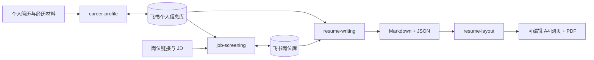

# Career Agent Workflow

一套可安装到个人 Agent 的中文求职工作流：用飞书管理真实资料和岗位，用 Agent 完成筛选与改写，用本地可编辑网页完成 A4 排版和 PDF 导出。

> 模型来自用户自己的 Codex、Claude Code、WorkBuddy 或其他兼容 Agent；本项目不提供模型 API，也不托管个人数据。



## 你能完成什么

- 把简历、项目记录和对话事实整理进飞书个人信息库；
- 对岗位库做全量筛选，得到评分、匹配点、短板和投递顺位；
- 只用已确认事实，为选定 JD 生成定向简历；
- 生成可编辑、可调行距、可备份恢复的一页 A4 网页与 PDF。

## 2 分钟快速开始

### 1. 安装本仓库 Skills

先复制本页仓库地址，然后运行：

```bash
git clone <复制的仓库地址>
cd career-agent-workflow
npx skills add . -y -g
```

也可以按 Agent 的目录手动安装：

| Agent | 用户级安装位置 |
|---|---|
| Codex | `~/.agents/skills/<skill-name>/` |
| Claude Code | `~/.claude/skills/<skill-name>/` |
| WorkBuddy / CodeBuddy | 设置页导入，或项目内 `.codebuddy/skills/<skill-name>/` |
| 其他 Agent | 导入 `skills/<skill-name>/SKILL.md`；必须支持本地文件和命令执行 |

Claude Code 的 Skill 目录与开放格式见[官方说明](https://code.claude.com/docs/en/slash-commands)，WorkBuddy/CodeBuddy 的目录和导入方式见[官方说明](https://cloud.tencent.com/document/product/1831/134516)。MiniMax 模型本身不负责加载本地 Skill；需要在支持 Agent Skills 的客户端中使用。

### 2. 安装飞书能力并完成飞书授权

```bash
npx @larksuite/cli@latest install
npx skills add larksuite/cli -y -g
lark-cli config init
lark-cli auth login --recommend
lark-cli auth status
```

详见[飞书连接与授权](docs/feishu-setup.md)。

### 3. 对 Agent 说

> 连接我的个人信息库和岗位库，筛选最适合我的两个 AI 产品岗位，为第一优先岗位生成一页定向简历。所有飞书写入先让我确认，文案确认后再排版。

## 5 个 Skill 如何协作

| Skill | 用途 | 是否写飞书 |
|---|---|---|
| `career-workflow` | 识别阶段并串联完整流程 | 由下游 Skill 决定 |
| `career-profile` | 创建、连接、审计和更新个人信息库 | 是，先确认 |
| `job-screening` | 提取 JD、评分、排序并写回岗位库 | 是，先确认 |
| `resume-writing` | 事实挖掘、定向改写和质量评分 | 默认只读 |
| `resume-layout` | 可编辑 A4 网页、备份和 PDF | 否，只写本地 |

## Skill 使用卡

### career-workflow

**输入：** 两个 Base 链接、当前目标、目标公司/岗位或 JD；可选推荐数量、城市、页数和输出目录。

**Prompt：**

> 连接我的个人信息库和岗位库，筛选 OPPO 最适合我的两个岗位，然后为第一优先岗位生成一页定向简历。

**输出：** 当前阶段、岗位排序、写入结果、简历与排版产物路径、下一步。

### career-profile

**输入：** 个人信息库链接，以及简历、项目记录、文档或本人描述。

**Prompt：**

> 读取这份简历，把已确认的信息整理进我的个人信息库；不确定的内容先问我。先展示拟写入内容，确认后再写入。

**输出：** 已确认事实、待确认事实、缺失问题、写入预览与结果。

### job-screening

**输入：** 两个 Base 链接，以及岗位链接、JD 文本或岗位库筛选范围。

**Prompt：**

> 从岗位库筛出最适合 AI 产品经理方向的 5 个岗位，结合个人信息库解释匹配点与短板，并在我确认后写回推荐岗位明细。

**输出：** 0–100 分、S/A/B/C 等级、匹配点、短板、优先级、推荐序号和投递建议。

### resume-writing

**输入：** 选定岗位或 JD、个人信息库链接；可选旧简历、页数和隐私限制。

**Prompt：**

> 针对岗位库中的第一优先岗位改写一页中文简历，只使用个人信息库中已确认的事实，未经确认的数字不要使用。

**输出：** Markdown、结构化 JSON、事实口径、缺失信息表与六维评分。

### resume-layout

**输入：** 已确认的简历 Markdown/JSON、输出目录；可选照片和样式参考。

**Prompt：**

> 把已确认的定向简历排成一页 A4 网页，保留编辑、行距调整、内容备份恢复和 PDF 导出，并运行页面填充校验。

**输出：** 可编辑网页、内容备份 JSON、PDF 与验证结果。

更多可直接复制的完整 Prompt 见 [Prompt 使用手册](docs/prompt-cookbook.md)。

## 飞书数据

个人信息库包含 8 张表：个人档案、教育经历、实习经历、经历素材、项目经历、技能与工具、目标岗位、荣誉奖项。

岗位库包含岗位清单和推荐岗位明细，通过双向关联连接。所有 Base、table 和 field ID 都在运行时读取，不写死在 Skill 或 README 中。

## 端到端示例

[匿名 OPPO 示例](examples/anonymized-oppo/README.md)展示：合成个人资料 → 两个岗位评分 → 第一/第二选择 → 定向简历输出。示例不包含真实姓名、联系方式、内部链接、飞书 ID 或公司敏感资料。

## 本地产物

```text
output/<company>-<role>/
├── resume.md
├── resume.json
├── index.html
├── styles.css
├── app.js
└── resume.pdf
```

`output/` 默认被 Git 忽略。

## 隐私与安全

- 用户资料、飞书链接、授权信息和生成简历默认不进入 Git；
- 默认使用飞书用户身份和最小权限；
- 所有飞书新增或更新先预览并确认；
- 第一版不删除表、字段或记录，也不自动投递岗位；
- 不把团队成果、Demo、POC、UAT 或测试包装成个人线上成果。

## 常见问题

CLI、授权、字段变化、分页、JD 读取和 A4 导出问题见[故障排查](docs/troubleshooting.md)。

## License

[MIT](LICENSE)
